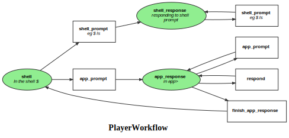

Markdown for PlayerWorkflow




## app_prompt -- guard


```php
#[AsGuardListener(self::WORKFLOW_NAME, self::TRANSITION_APP_PROMPT)]
public function onAppPromptGuard(GuardEvent $event): void
{
    $player = $this->getPlayer($event);
    if (!$player->getEvent()->endWithAppPrompt()) {
        $event->setBlocked(true, "text does not end with >");
    }
}
```
blob/main/src/Workflow/PlayerWorkflow.php#L29-35
        

## shell_prompt -- guard


```php
#[AsGuardListener(self::WORKFLOW_NAME, self::TRANSITION_SHELL_PROMPT)]
public function onShellPromptGuard(GuardEvent $event): void
{
    $player = $this->getPlayer($event);
    if (!$player->getEvent()->endWithShellPrompt()) {
        $event->setBlocked(true, "text does not end with %|$");
    }
}
```
blob/main/src/Workflow/PlayerWorkflow.php#L38-44
        


## app_prompt -- transition


```php
#[AsTransitionListener(self::WORKFLOW_NAME, self::TRANSITION_APP_PROMPT)]
public function onAppPrompt(TransitionEvent $event): void
{
    $player = $this->getPlayer($event);
}
```
blob/main/src/Workflow/PlayerWorkflow.php#L54-57
        

## respond -- transition


```php
#[AsTransitionListener(self::WORKFLOW_NAME, self::TRANSITION_RESPOND)]
public function onRespond(TransitionEvent $event): void
{
    $player = $this->getPlayer($event);
}
```
blob/main/src/Workflow/PlayerWorkflow.php#L61-64
        

## shell_prompt -- transition


```php
#[AsTransitionListener(self::WORKFLOW_NAME, self::TRANSITION_SHELL_PROMPT)]
public function onShellPrompt(TransitionEvent $event): void
{
    $player = $this->getPlayer($event);
}
```
blob/main/src/Workflow/PlayerWorkflow.php#L47-50
        
