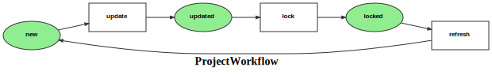

Markdown for ProjectWorkflow




##  -- guard


```php
#[AsGuardListener(self::WORKFLOW_NAME)]
public function onGuard(GuardEvent $event): void
{
    /** @var Project project */
    $project = $event->getSubject();

    switch ($event->getTransition()->getName()) {
    /*
    e.g.
    if ($event->getSubject()->cannotTransition()) {
      $event->setBlocked(true, "reason");
    }
    App\Entity\Project
    */
        case self::TRANSITION_UPDATE:
            break;
        case self::TRANSITION_LOCK:
            break;
        case self::TRANSITION_REFRESH:
            break;
    }
}
```
blob/main/src/Workflow/ProjectWorkflow.php#L33-53
        


## lock -- transition


```php
#[AsTransitionListener(self::WORKFLOW_NAME, self::TRANSITION_LOCK)]
public function onLock(TransitionEvent $event): void
{
    $project = $this->getProject($event);
}
```
blob/main/src/Workflow/ProjectWorkflow.php#L66-69
        

## refresh -- transition


```php
#[AsTransitionListener(self::WORKFLOW_NAME, self::TRANSITION_REFRESH)]
public function onRefresh(TransitionEvent $event): void
{
    $project = $this->getProject($event);
}
```
blob/main/src/Workflow/ProjectWorkflow.php#L73-76
        

## update -- transition


```php
#[AsTransitionListener(self::WORKFLOW_NAME, self::TRANSITION_UPDATE)]
public function onUpdate(TransitionEvent $event): void
{
    $project = $this->getProject($event);
    $this->updateGit($project->getLocalDir());

}
```
blob/main/src/Workflow/ProjectWorkflow.php#L57-62
        
