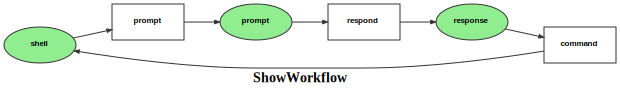

Markdown for ShowWorkflow




##  -- guard


```php
#[AsGuardListener(self::WORKFLOW_NAME)]
public function onGuard(GuardEvent $event): void
{
    $show = $this->getShow($event);

    switch ($event->getTransition()->getName()) {
    /*
    e.g.
    if ($event->getSubject()->cannotTransition()) {
      $event->setBlocked(true, "reason");
    }
    App\Entity\Show
    */
        case self::TRANSITION_PROMPT:
            break;
        case self::TRANSITION_RESPOND:
            break;
        case self::TRANSITION_COMMAND:
            break;
    }
}
```
blob/main/src/Workflow/ShowWorkflow.php#L29-48
        


## command -- transition


```php
#[AsTransitionListener(self::WORKFLOW_NAME, self::TRANSITION_COMMAND)]
public function onCommand(TransitionEvent $event): void
{
    $show = $this->getShow($event);
}
```
blob/main/src/Workflow/ShowWorkflow.php#L66-69
        

## prompt -- transition


```php
#[AsTransitionListener(self::WORKFLOW_NAME, self::TRANSITION_PROMPT)]
public function onPrompt(TransitionEvent $event): void
{
    $show = $this->getShow($event);
}
```
blob/main/src/Workflow/ShowWorkflow.php#L52-55
        

## respond -- transition


```php
#[AsTransitionListener(self::WORKFLOW_NAME, self::TRANSITION_RESPOND)]
public function onRespond(TransitionEvent $event): void
{
    $show = $this->getShow($event);
}
```
blob/main/src/Workflow/ShowWorkflow.php#L59-62
        
